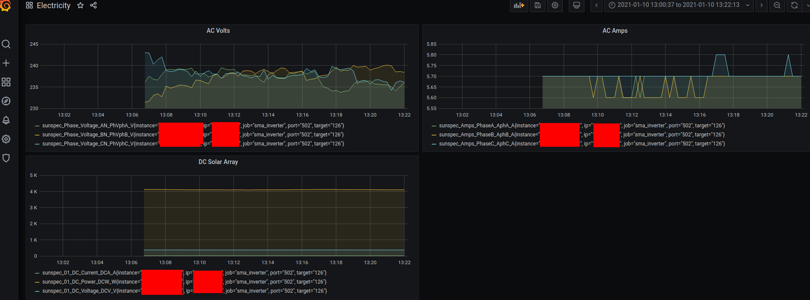
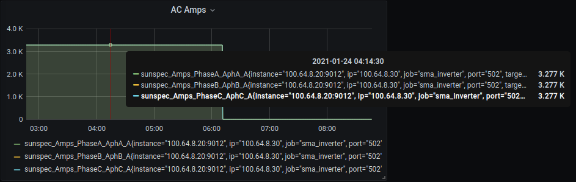

# Prometheus Sunspec Exporter

- Works and is Pulling data :-D
- May have some re-coding to do around what consitutes a gauge, counter etc
- is optimised to read only the "sunspec" model you desire (reduce call load on the device)
- Need to run one exporter "per" modbus sunspec address/ip/port (current limitation)
- Uses https://github.com/sunspec/pysunspec

# Sunspec Devices 
  Sunspec is alliance of 100 Solar and Electricity Storage products, that provides a standard Modbu API.

  With this API, a prometheus exporter was born, in approximately 8 hours.

  Devices supported can be found here (Sunspec Modbus Certified List)[https://sunspec.org/sunspec-modbus-certified-products/]
  Manufacturers supporting Sunspec:
  - Fronius
  - SMA
  - Huawei
  - ABB
  - Sungrow

  See (tested-devices)[docs/tested-devices.md] for more information.

# Sample Grafana



# Bulding 

`docker build -t inosion/sunspec-exporter .`

# Running the Exporter

```
sunspec-prometheus-exporter
Usage:
  sunspec_exporter.py start [ --port PORT ] [ --sunspec_address SUNSPEC_ADDRESS ] --sunspec_ip SUNSPEC_IP --sunspec_port SUNSPEC_PORT --sunspec_model_ids MODEL_IDS 
  sunspec_exporter.py query [ --sunspec_address SUNSPEC_ADDRESS ] --sunspec_ip SUNSPEC_IP --sunspec_port SUNSPEC_PORT 

Options:
  -h --help                          Show this screen.
  --version                          Show version.
  query                              Dump out current data for analysis; and exit
  start                              Run the prometheus node_exporter
  --port PORT                        Prometheus Client listen port [default: 9807]
  --sunspec_ip SUNSPEC_IP            IP Address of the SunSpec device (Modbus TCP)
  --sunspec_model_ids MODEL_IDS      Comma separated list of the ids of the module you want the data from
  --sunspec_port SUNSPEC_PORT        Modbus port [default: 502]
  --sunspec_address SUNSPEC_ADDRESS  Target modbus device address [default: 1]

```

When it runs for the first time it will call the device, and poll all the data in the model. 
The model_ids filter then removes sets of data, (config, name, serial etc)

```
✔ ~/projects/github.com/inosion/prometheus-sunspec-exporter [main|✚ 2…1] 
12:43 $ docker run -ti --rm -p 9807:9807 inosion/sunspec-exporter start --port 9807 --sunspec_ip IPADDRESS --sunspec_port 502 --sunspec_address 126 --sunspec_model_ids 103,160
{'--port': '9807',
 '--sunspec_address': '126',
 '--sunspec_ip': 'IPADDRESS',
 '--sunspec_model_ids': '103,160',
 '--sunspec_port': '502',
 'start': True}
# !!! Enumerating all models, removing from future reads unwanted ones
#    Removed [Common (1)]
#    Removed [Ethernet Link Layer (11)]
#    Removed [IPv4 (12)]
#  Keeping [Inverter (Three Phase) (103)]
#    Removed [Nameplate (120)]
#    Removed [Basic Settings (121)]
#    Removed [Measurements_Status (122)]
#    Removed [Immediate Controls (123)]
#    Removed [Storage (124)]
#    Removed [Static Volt-VAR (126)]
#    Removed [Freq-Watt Param (127)]
#    Removed [Dynamic Reactive Current (128)]
#    Removed [Watt-PF (131)]
#    Removed [Volt-Watt (132)]
#  Keeping [Multiple MPPT Inverter Extension Model (160)]

Timestamp: 2021-01-10T01:43:57Z
# ---------------------
# model: Inverter (Three Phase) (103)
# ---------------------
# Amps_A_A: 17.1
# Amps_PhaseA_AphA_A: 5.7
# Amps_PhaseB_AphB_A: 5.7
# Amps_PhaseC_AphC_A: 5.7
# Phase_Voltage_AN_PhVphA_V: 237.0
# Phase_Voltage_BN_PhVphB_V: 232.10000000000002
# Phase_Voltage_CN_PhVphC_V: 239.8
# Watts_W_W: 4040.0
# Hz_Hz_Hz: 49.980000000000004
# VA_VA_VA: 4040.0
# VAr_VAr_var: 0.0
# WattHours_WH_Wh: 14722540.0
# Cabinet_Temperature_TmpCab_C: 53
# Operating_State_St: 4
# Event1_Evt1: 0
# ---------------------
# model: Multiple MPPT Inverter Extension Model (160)
# ---------------------
# Number_of_Modules_N: 2
# 01_Input_ID_ID: 1
# 01_DC_Current_DCA_A: 11.0
# 01_DC_Voltage_DCV_V: 373
# 01_DC_Power_DCW_W: 4100.0
# 02_Input_ID_ID: 2
# 02_DC_Current_DCA_A: 0.0
# 02_DC_Voltage_DCV_V: 0
# 02_DC_Power_DCW_W: 0.0
```
# Finding out What data you want

SunSpec devices conform to some data standards,
Run the following 

```
docker run --rm -ti inosion/sunspec-exporter query --sunspec_address 126 --sunspec_ip IP_OF_INVERTER --sunspec_port 502
```

to find out what your data set, available, is.
You will get a MASSIVe dump, skip past the XML to the nice text, and look at the values printed, work out which "model_id" you are after, 
which section, and then that becomes your set of model_id's.


# Installing at Your place

1. Build it `docker build -t inosion/sunspec-exporter .`
2. Save it `docker save | gzip > inosion_sunspec_exporter.tgz`
3. Copy it to your running place
    `sudo docker load < ~/inosion_sunspec_exporter.tgz`
4. Use the sample `systemd` unit file  [install/prometheus-sunspec-exporter.service](install/prometheus-sunspec-exporter.service)
     ```
     sudo cp install/prometheus-sunspec-exporter.service /lib/systemd/system/
     sudo systemctl enable prometheus-sunspec-exporter.service 
     sudo systemctl start prometheus-sunspec-exporter.service 
     ```
5. Configure your Prometheus to collect the data [install/prometheus.yml](install/prometheus.yml)

# Testing 

```
docker run -ti --rm -v `pwd`/sunspec_exporter:/sunspec_exporter -p 9807:9807 inosion/sunspec-exporter python3 /sunspec_exporter/sunspec_exporter.py start --port 9807 --sunspec_ip <SMA_SUNNYBOY_INVERTER_IP> --sunspec_port 502 --sunspec_address 126 --sunspec_model_ids 103,160
```

Call it and see what you get:

`curl http://localhost:9807/metrics`

result example
```
sunspec_Phase_Voltage_AN_PhVphA_V{ip="192.168.1.70",port="502",target="126"} 237.20000000000002
# HELP sunspec_Phase_Voltage_BN_PhVphB_V 
# TYPE sunspec_Phase_Voltage_BN_PhVphB_V gauge
sunspec_Phase_Voltage_BN_PhVphB_V{ip="192.168.1.70",port="502",target="126"} 234.3
# HELP sunspec_Phase_Voltage_CN_PhVphC_V 
# TYPE sunspec_Phase_Voltage_CN_PhVphC_V gauge
sunspec_Phase_Voltage_CN_PhVphC_V{ip="192.168.1.70",port="502",target="126"} 240.3
# HELP sunspec_Watts_W_W 
# TYPE sunspec_Watts_W_W gauge
sunspec_Watts_W_W{ip="192.168.1.70",port="502",target="126"} 4040.0
# HELP sunspec_Hz_Hz_Hz 
# TYPE sunspec_Hz_Hz_Hz gauge
sunspec_Hz_Hz_Hz{ip="192.168.1.70",port="502",target="126"} 50.0
# HELP sunspec_VA_VA_VA 
# TYPE sunspec_VA_VA_VA gauge
sunspec_VA_VA_VA{ip="192.168.1.70",port="502",target="126"} 4040.0
# HELP sunspec_VAr_VAr_var 
# TYPE sunspec_VAr_VAr_var gauge
sunspec_VAr_VAr_var{ip="192.168.1.70",port="502",target="126"} 0.0
# HELP sunspec_WattHours_WH_Wh 
# TYPE sunspec_WattHours_WH_Wh gauge
sunspec_WattHours_WH_Wh{ip="192.168.1.70",port="502",target="126"} 1.472271e+07
# HELP sunspec_Cabinet_Temperature_TmpCab_C 
# TYPE sunspec_Cabinet_Temperature_TmpCab_C gauge
sunspec_Cabinet_Temperature_TmpCab_C{ip="192.168.1.70",port="502",target="126"} 53.0
# HELP sunspec_Operating_State_St_total 
```

# Filtering

Some devices needs some tweaking, on the values they return.
Some SMA Solar inverters return 3276.8 for NaN. 
At night time, the DC Amps returns that value. Which is non too helpful in Grafana



To correct this, we can remap each returned value, before prometheus collects it. 

```
# Example of METRICFILTER
--filter "Amps_Phase[ABC]_Aph[ABC]_A gt:3276 0.0"
```
METRICFILTER is a space separated 3-Tuple, <metric_regex> <function>:<args> <replace_value> 

"Amps_Phase[ABC]_Aph[ABC]_A gt:3276 0.0"

Which reads, when the metric matching regex, Amps_Phase[ABC]_Aph[ABC]_A is greater than 3276, set the metric as 0.
In this example case, the inverter jumps from low 0.4, 0.5 Amps, up to 3276.7 (signed int16 Upper) represented as NaN. 

This filter config removes that problem.


# Testing with SunSpec

See [testing/](testing/)